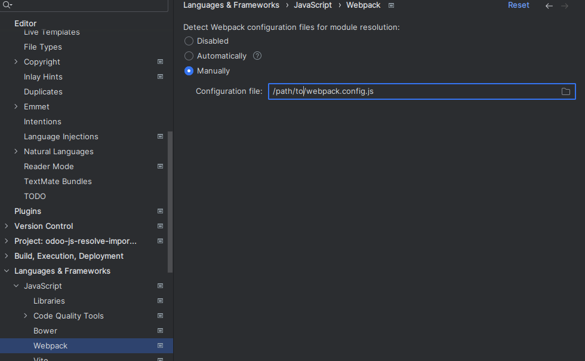
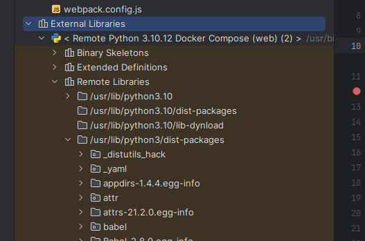

# Odoo resolve javascript imports

Webpack configuration file to resolve odoo javascript imports.

## Pycharm guide

- In Pycharm, go to "File/Settings/Languages and Frameworks/Javascript/Webpack" (use the search tool) and select the Manually option, and set the webpack.config.js file.


- Go to "File/Settings/Project/Project Structure", select the option Add Content Root and set the Odoo source folder with the option Mark as Sources.
- If you use a Docker-compose interpreter Pycharm already map remote folders inside a local folder.



## Troubleshooting
Sometimes, PyCharm doesn't refresh changes immediately. You can try adding an alias manually, for example:
```json
alias: {
  "@web": "/path/to/odoo/addons/web/src",
}
```
When resolve this import, change to the original code
```json
alias: alias,
```
## Finally
If you know a better way for resolving Odoo javascript imports, please contact me
racielperdomo1993@gmail.com